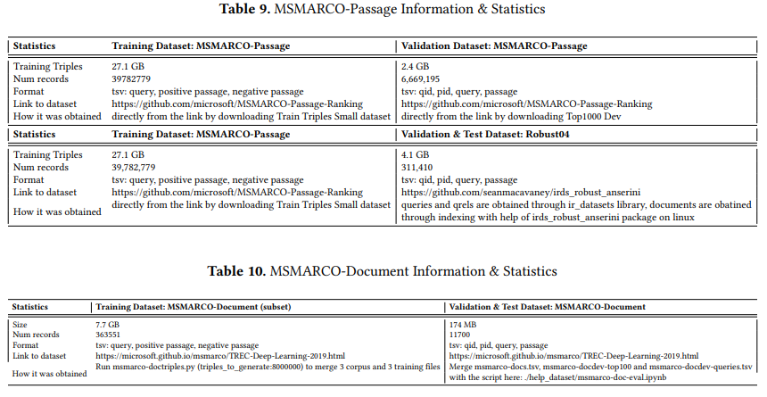
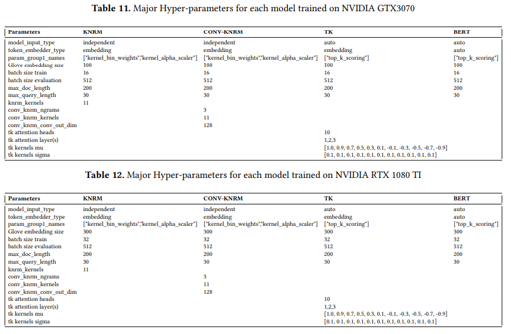

# Reproducing TK paper

This repository is made for reproducing the results of the paper *Interpretable & Time-Budget-Constrained Contextualization for Re-Ranking* for the master course Information Retrieval 2 at University of Amsterdam.

The report is concluded in this repository: ./report.pdf

For summary of all the reproducible and research results, you can read this slide we used for our presentation: https://docs.google.com/presentation/d/1_i1f7TyuUlFKn8QZmraijOlJtVF9VLWOXjyq9a4n_qY/edit?usp=sharing

Note due to the large files not convenient to be handled by github, we have removed all pretrained models, pre-trained glove embeddings, best-validation-outputs and the content inside of data folder on the github repo. In case of any potential problem, we provide a link to download the entire repository with everything included:

The models of our interest only include KNRM, CONV-KNRM, TK (layer 1,2,3) and BERT. If readers want to reproduce other models, please create a new yaml file inside of ./config/train/models_config.

# Environment

You need a GPU in order to run all the experiments. The CUDA Version we use is 11.3 to run all experiments without problems. Please note for computers with Linux system, you can directly run the following comments to build the environment:

```
conda create -n matchmaker python=3.8
conda activate matchmaker
conda install --file conda-requirements.txt -c conda-forge -c pytorch
pip install -r pip-requirements.txt
```

If you use Windows operation system, there might be some conflicts running the above comments to install all the packages. To solve this problem, please install all the packages (faiss, allennlp, huggingface, etc) listed in conda-requirements.txt and pip-requirements.txt separately (one by one). 

# Commands

Commands for running all the models for msmarco-passage are as follows: 

```
python .\matchmaker\train.py --run-name msmarco_passage_conv_knrm --config-file .\config\train\models_config\defaults_conv_knrm.yaml .\config\train\data_config\msmarco.yaml

python .\matchmaker\train.py --run-name msmarco_passage_knrm --config-file .\config\train\models_config\defaults_knrm.yaml .\config\train\data_config\msmarco.yaml

python .\matchmaker\train.py --run-name msmarco_passage_bert --config-file .\config\train\models_config\defaults_bert.yaml .\config\train\data_config\msmarco.yaml

python .\matchmaker\train.py --run-name msmarco_passage_TK1 --config-file .\config\train\models_config\defaults_TK1.yaml .\config\train\data_config\msmarco.yaml

python .\matchmaker\train.py --run-name msmarco_passage_TK2 --config-file .\config\train\models_config\defaults_TK2.yaml .\config\train\data_config\msmarco.yaml

python .\matchmaker\train.py --run-name msmarco_passage_TK3 --config-file .\config\train\models_config\defaults_TK3.yaml .\config\train\data_config\msmarco.yaml
```

For evaluating on Robust04, just replace data config file to .\config\train\data_config\robust04.yaml

Commands for running all the models for msmarco-document are as follows: 

```
python .\matchmaker\train.py --run-name msmarco_document_conv_knrm --config-file .\config\train\models_config\defaults_conv_knrm.yaml .\config\train\data_config\msmarco_doc.yaml
python .\matchmaker\train.py --run-name msmarco_document_knrm --config-file .\config\train\models_config\defaults_knrm.yaml .\config\train\data_config\msmarco_doc.yaml
python .\matchmaker\train.py --run-name msmarco_document_bert --config-file .\config\train\models_config\defaults_bert.yaml .\config\train\data_config\msmarco_doc.yaml
python .\matchmaker\train.py --run-name msmarco_document_TK1 --config-file .\config\train\models_config\defaults_TK1.yaml .\config\train\data_config\msmarco_doc.yaml
python .\matchmaker\train.py --run-name msmarco_document_TK2 --config-file .\config\train\models_config\defaults_TK2.yaml .\config\train\data_config\msmarco_doc.yaml
python .\matchmaker\train.py --run-name msmarco_document_TK3 --config-file .\config\train\models_config\defaults_TK3.yaml .\config\train\data_config\msmarco_doc.yaml
```

# Pre-trained Glove Embeddings

Download glove300 data from https://www.kaggle.com/yutanakamura/glove42b300dtxt/code or glove100 from https://www.kaggle.com/danielwillgeorge/glove6b100dtxt and put it into ./config/train/embeddings/. Currently the default one used in the code is glove100, if you want to use glove300, please go to ./config/train/data_config/ and for all yaml files in this folder, change pre_trained_embedding_dim to 300 and pre_trained_embedding to the path where you put your glove300 file.

# Configuration of data and models

In ./config/train/data_config and ./config/train/models_config you can change the configurations or add configurations for the datasets and the models. Note that different models require different parameters to run, here we provide a summary of the information for models and datasets in our report.

## Datasets


## Hypaparameters



# Data Preprocessing

./help_data:this folder is used for preprocessing the data

## MSMARCO-Passage

There is no preprocessing procedure for MSMARCO-Passage dataset. For MSMARCO-Passage dataset preprocessing: download [triples.train.small.tar.gz](https://msmarco.blob.core.windows.net/msmarcoranking/triples.train.small.tar.gz), https://msmarco.blob.core.windows.net/msmarcoranking/top1000.dev.tar.gz, https://msmarco.blob.core.windows.net/msmarcoranking/top1000.eval.tar.gz

Then put these 3 datasets into ./data/train ./data/validation and ./data/test respectively.

## MSMARCO-Document

For MSMARCO-document dataset preprocessing:
Downloaded all datasets from: https://microsoft.github.io/msmarco/TREC-Deep-Learning-2019.html and upzip them, keep the zipped and unzipped ones into ./help_data/msmarco-doc/ folder.


To generate first-stage triples.tsv used for training MSMARCO-document dataset, run the following command

```
cd ./help_data/msmarco-doc
python triples.py
```

Then use ./help_data/msmarco-doc/triples.train.process.ipynb for converting the triples.tsv to the exact triples.train format used for training the models.
For generating eval and test files, please use ./help_data/msmarco-doc/msmarco-doc-test.ipybn and ./help_data/msmarco-doc/msmarco-doc-eval.ipybn

## Robust04

For Robust04 dataset preprocessing:
Dataset is downloaded from: 
https://ir-datasets.com/trec-robust04.html
https://github.com/seanmacavaney/irds_robust_anserini

Firstly download and unzip the datasets from this link https://drive.google.com/file/d/15aNUjxFwYnC3kANKBYujFRZbrhqzxpst/view?usp=sharing then unzip to the ./help_data/robust04 folder.
To generate the evaluation dataset of Robust04
cd ./help_data/robust04
Then use ./help_data/robust04/Robust04.ipynb for merging df1.csv (qid, query), df2.csv (docid, doc), df3.csv (qrels format) to the exact validation format used for evaluating the models.

# Analysis

Quantitative analysis modified files: 
./matchmaker/eval.py
./matchmaker/models/evai_20_tk.py
./matchmaker/modules/neuralIR_encoder.py

Qualitative analysis modified files:


# Contact

If you have any question, please feel free to contact us:

Hidde Lekanne gezegd Deprez: hidde.lekannegezegddeprez@student.uva.nl

Noud Corten: noud.corten@student.uva.nl

Qingzhi Hu: qingzhi.hu@student.uva.nl


